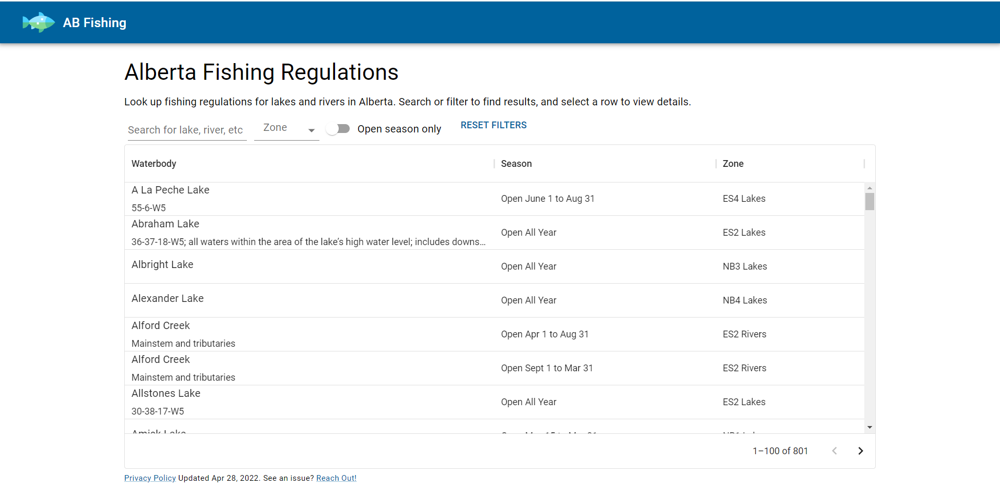
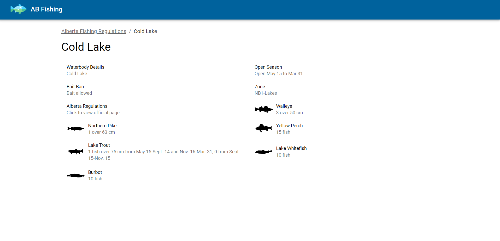

    <a name="readme-top"></a>

<!-- PROJECT LOGO -->
<br />
<div align="center">
  <a href="https://www.abfishing.ca">
    
  </a>

  <h3 align="center">AB Fishing</h3>

  <p align="center">
    A website dedicated to providing up to date information on the fishing regulations for rivers and lakes in Alberta.
    <br />
    <br />
    <a href="https://www.abfishing.ca">View site</a>
    ·
    <a href="mailto:%61bfis%68in%67ca@gm%61il.c%6Fm">Report an Issue</a>
    
  </p>
</div>

<!-- TABLE OF CONTENTS -->
<details>
  <summary>Table of Contents</summary>
  <ol>
    <li>
      <a href="#about-the-project">About The Project</a>
      <ul>
        <li><a href="#built-with">Built With</a></li>
      </ul>
    </li>
    <li>
      <a href="#getting-started">Getting Started</a>
      <ul>
        <li><a href="#prerequisites">Prerequisites</a></li>
        <li><a href="#installation">Installation</a></li>
      </ul>
    </li>
    <li><a href="#usage">Usage</a></li>
    <li><a href="#roadmap">Roadmap</a></li>
    <li><a href="#license">License</a></li>
    <li><a href="#contact">Contact</a></li>
  </ol>
</details>

<!-- ABOUT THE PROJECT -->

## About The Project



There are many lakes and rivers in Alberta to fish in. Each waterbody has it's own disinct rules on when to fish, what can be kept, and what kind of bait to use.



These regulations are set and published by the [Alberta Government](https://albertaregulations.ca/fishingregs/). However, the format that it's published is a pdf version of a printed magazine, which is not very friendly to a user reading on a screen or phone. Furthermore, trip planning or comparing one lake to another is a real pain.

AB Fishing was created with this in mind:

- It should be very easy for a user to find a waterbody they are looking for.
- Fishing regulations should be presented in an easy to digest format that is accessible for the amateur angler.
- The published regulations from the Alberta Government are the absolute source of truth. This is key. The data served to the client can be completely replaced upon updating from the province regulations.
- Where possible, try to link back to the section on the official government site so the user can view the official regulations if they need to.

<p align="right">(<a href="#readme-top">back to top</a>)</p>

<!-- GETTING STARTED -->

## Getting Started

To get a local copy up and running follow these simple example steps.

### Prerequisites

This is an example of how to list things you need to use the software and how to install them.

```sh
yarn install
```

### Fetching Latest Regulations

The parsing of government regulations is automated and can be run with the following steps:

1. Install local dependencies
2. Run `yarn parse`, which fetches latest regulations from the remote site, parses the info from the PDFs, then writes to local regulations file.
3. Review changes to ensure they make sense

<p align="right">(<a href="#readme-top">back to top</a>)</p>

<!-- ROADMAP -->

## Roadmap

- [ ] Setup regulations parser to run on interval and notify automatically when changes exist
- [ ] Migrate to emotion js
- [ ] Investigate migrating table to list component since most users are mobile
- [ ] Add favorite waterbody feature

<p align="right">(<a href="#readme-top">back to top</a>)</p>

<!-- LICENSE -->

## License

Distributed under the MIT License. See `LICENSE.txt` for more information.

<p align="right">(<a href="#readme-top">back to top</a>)</p>

<!-- CONTACT -->

## Contact

Taylor Dixon - <a href="mailto:%61bfis%68in%67ca@gm%61il.c%6Fm">Email Me</a>

<p align="right">(<a href="#readme-top">back to top</a>)</p>
